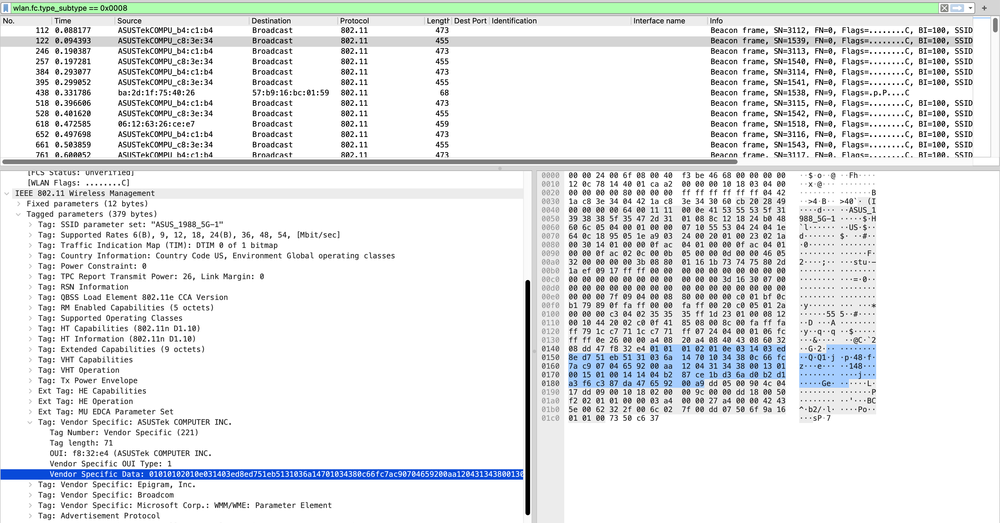
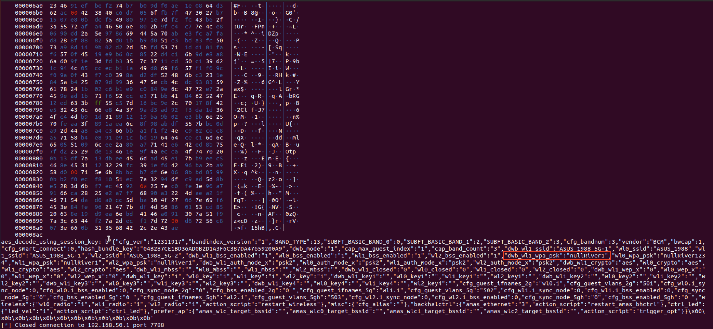

# ASUS AiMesh Attack
## Intro
In this write-up, we use ASUS XT8 HW Ver: 1.0, firmware version 3.0.0.4.388_24609 as an illustration example. 

The ASUS AiMesh protocol is one kind of upper-layer NAPS protocol. In its original version, it combined "group_id"/"cfg_group" with random nonces (Ns and Nc) to encrypt TCP payloads.

Thus, the key to breaking this protocol is that an attacker should get/steal the value of "group_id"/"cfg_group" through some means. Luckily, we spot a cross-layer key leakage: a special hash value of "group_id"/"cfg_group" is leaked at 802.11 link layer. 

## Attack Step 1: Collect "group_id"/"cfg_group" hashes



First, collect some 802.11 beacon frames from fronthaul links of the XT8 mesh network. Scroll down to the vendor specific information for "ASUSTek". Take out the 0x14 bytes after "\x03\x14": "\x03\xed\x8e\xd7\x51\xeb\x51\x31\x03\x6a\x14\x70\x10\x34\x38\x0c\x66\xfc\x7a\xc9".

The last 4 bytes "\x66\xfc\x7a\xc9" is T(pub), the first 0x10 bytes is H(GID), as illustrated in the paper. 

We query the ARP cache to obtain the MAC address of the gateway 192.168.50.1 to be "04:42:1A:B4:C1:B0". We thus use the following python3 script to enumerate all possible values of T(pub). Download the file at [here](./compute_Tpri.py)

After running this script, we obtain "found: 1718158561". This is the value of T(pri). We thus reconstruct cfg_group:

```
➜  ~ md5 -s 04:42:1A:B4:C1:B0_1718158561

633ed873722e542e6ccb037737a38c5d
```

"633ed873722e542e6ccb037737a38c5d" is the correct value of "cfg_group" stored in mesh nodes' NVRAM.  

## Attack Step 2: Use guessed "cfg_group" to pull access policies from the gateway
Finally, we put such "cfg_group" value in the script below to pull Wi-Fi passphrases continuously. Download the file at [here](./asus_pull_wifi_passphrase.py)

Install dependencies as needed. 

Change the hard-coded gateway IP address 192.168.50.1 to your own address. 

Change the "cfg_group" value of "633ED873722E542E6CCB037737A38C5D" to your own value. 

Change "04:42:1A:C8:3E:30" to an existing extender node's MAC address. 

As we can see, the Wi-Fi passphrase is "nullRiver1":



