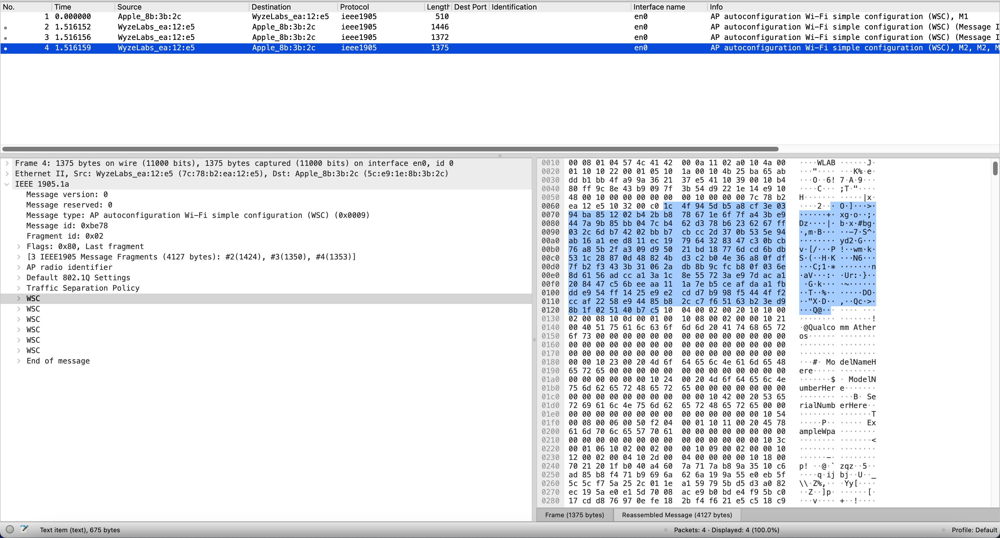
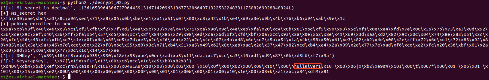

# EasyMesh Attack
## Intro
In this write-up, we use Wyze Wi-Fi 6E Mesh Router Pro, firmware version 1.0.1.109 as an illustration example. 

Wyze mesh networks implement Wi-Fi EasyMesh. However, this standard is flawed by design, having no "real" authentication.

## Attack Step 1: Run the attack script and monitor EasyMesh traffic with Wireshark

To perform the Wi-Fi passphrase stealing attack through the EasyMesh protocol, we use [this script](./query_EasyMesh.py)

You might want to change `dst='7c:78:b2:ea:12:e5'` to your own gateway's MAC address. Change `src=b'\x5c\xe9\x1e\x8b\x3b\x2c'` to your own laptop's MAC address. Change `iface="en0"` to your own laptop's wireless interface name. 

Run Wireshark before you launch this script. Then, you will be able to see the gateway returning something interesting:

## Attack Step 2: Decrypt EasyMesh responses to read Wi-Fi passphrases. 
We provide [another script](./decrypt_M2.py).

Populate `ENonce`, `RNonce`, `Encrypted_Settings`, `PK_R`, `EnrolleeMAC` with the content of the first WSC in the [traffic capture](./EasyMesh_sample_capture.pcapng)

Run `decrypt_M2.py` with `python2` (not python3).

You can see Wi-Fi fronthaul/backhaul passphrases there:

