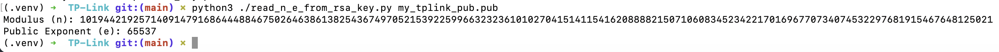
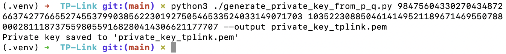
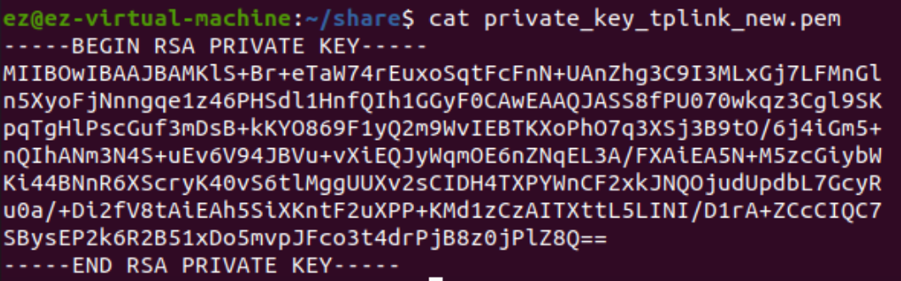

# Crack a 512-bit RSA public key and learn the private key

## Attack Step 1: Print the number n and e from the public key file

I have prepared a [script](./read_n_e_from_rsa_key.py) for this purpose. Run this script with your 512-bit RSA public key file. 

My number n in RSA is:
`10194421925714091479168644488467502646386138254367497052153922599663232361010270415141154162088882150710608345234221701696770734074532297681915467648125021`

## Attack Step 2: Factor the big number n and get p and q

Read [this blog](http://gilchrist.great-site.net/jeff/factoring/nfs_beginners_guide.html?i=1)

This step might take several days. 

I have my p and q here: 
`98475604330270434872663742776655274553799038562230192750546533524033149071703`
`103522308850461414952118967146955078800028111873755980559168280414306621177707`

## Attack Step 3: Reconstruct the private key with p and q

I have prepared another [script](./generate_private_key_from_p_q.py) for this purpose. Run this script with your p and q. 

## Attack Step 4: Let openssl parse this private key and produce a new private key in openssl format
You have to execute this command with openssl on Ubuntu 20.04, not on macOS. 
`openssl rsa -in private_key_tplink.pem -out private_key_tplink_new.pem`

Then you can switch back to the [main tutorial](./README.md)